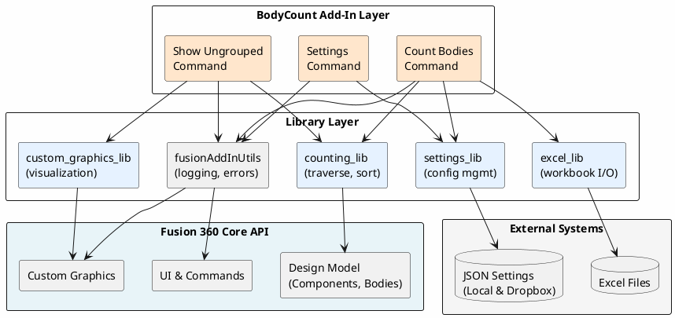
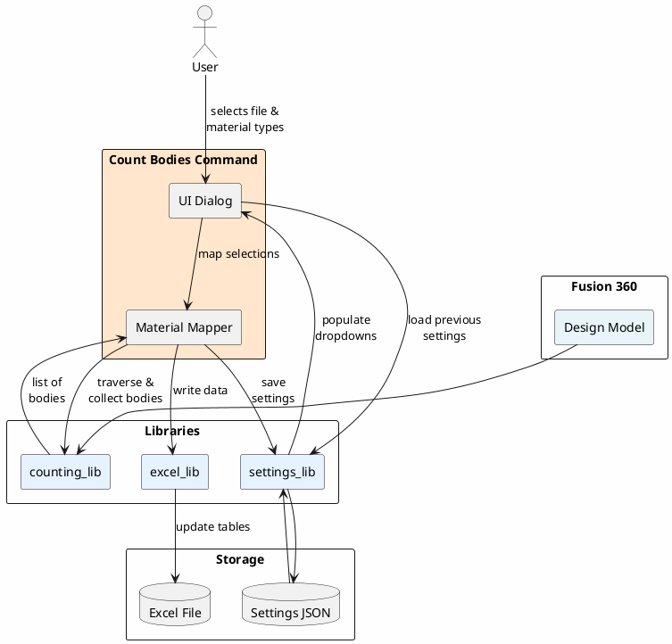
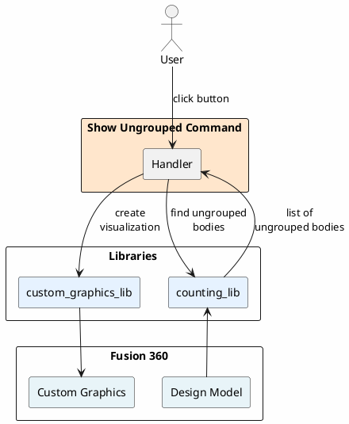
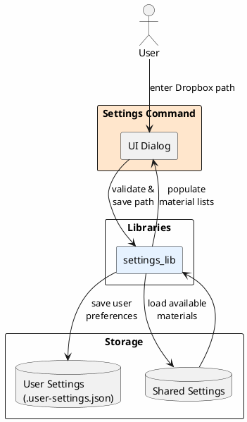

# BodyCount Add-In Architecture

## System Overview

BodyCount is a Fusion 360 add-in with three main commands that help users count and categorize CAD bodies, export data to Excel, and visualize ungrouped components.

## Architecture Diagram - Overall Structure



## Command-Specific Data Flows

### Count Bodies Command


### Show Ungrouped Command


### Settings Command


## Data Flow

### Count Bodies Command
```
User Input (Excel file, Material selection)
    ↓
→ Load File Settings (previous selections)
→ Load Shared Settings (available materials)
→ Traverse Design (counting_lib)
    └─ Iterate components recursively
    └─ Filter by visibility & naming rules
    └─ Collect bodies per module/category
→ Map Bodies to Materials
    └─ Apply naming conventions (1-9, 10, 12, etc.)
→ Write to Excel (excel_lib)
    └─ Open Excel workbook
    └─ Populate IndividualParts table
    └─ Populate ModulesParts table
    └─ Save file
→ Save File Settings (remember selections)
```

### Show Ungrouped Command
```
User clicks "Show Ungrouped"
    ↓
→ Traverse Design (counting_lib)
→ Find ungrouped bodies
→ Create Custom Graphics (custom_graphics_lib)
    └─ Render transparent red highlighting
```

### Settings Command
```
User enters Dropbox path
    ↓
→ Validate path (check writeability)
→ Save to User Settings (.user-settings.json)
→ Load/refresh Shared Settings from Dropbox
    └─ Available materials (wood, steel/brass numbers)
    └─ Update dropdown lists
```

## Key Design Patterns

1. **Modular Commands**: Each command is independent but shares common utilities
2. **Settings Hierarchy**: User settings → File settings → Shared settings (Dropbox)
3. **Generator-based Traversal**: Recursive generators for memory-efficient tree navigation
4. **Type-hinted Dataclasses**: Strong typing for Excel structures (Body, Module)
5. **Centralized Error Handling**: All errors routed through `futil.handle_error()`
6. **Event-driven UI**: Fusion 360 command handlers for user interaction
7. **Directory Writeability Validation**: Real file creation test to ensure write access

## File Organization

```
BodyCount/
├── BodyCount.py              # Add-in entry point (startup/shutdown)
├── config.py                 # Global configuration
├── commands/
│   ├── count_bodies/         # Main counting & export command
│   ├── show_ungrouped/       # Visual highlighting command
│   └── settings/             # User settings command
└── lib/
    ├── counting_lib/         # CAD model traversal
    ├── excel_lib/            # Excel I/O operations
    ├── settings_lib/         # Settings management (JSON serialization)
    ├── custom_graphics_lib/  # Visual rendering
    └── fusionAddInUtils/     # Logging, error handling, event management
```

## Material Support

### Wood Materials
- **Storage**: Shared settings (Dropbox)
- **Management**: Dynamic list editable in Settings dialog
- **Scope**: All modules can select wood material

### Steel/Brass Materials
- **Storage**: Shared settings (steel/brass part number mapping)
- **Management**: Hardcoded options [Steel, Brass]
- **Scope**: All modules can select Steel or Brass
- **Mapping**: Steel/Brass numbers in shared settings determine material selection

## Settings File Structure

### User Settings (`.user-settings.json`)
```json
{
    "shared_data_path": "/path/to/dropbox",
    "overwrite": true
}
```

### Shared Settings (`<Dropbox Path>/Vermland/The Collection/BodyCount/shared_settings.json`)
```json
{
    "wood_materials": ["Material1", "Material2", ...],
    "steel_brass_numbers": [[10, 20], [11, 21], ...]
}
```

### File Settings (Project-specific, stored in project)
Stores per-module material selections and Excel file path references.
